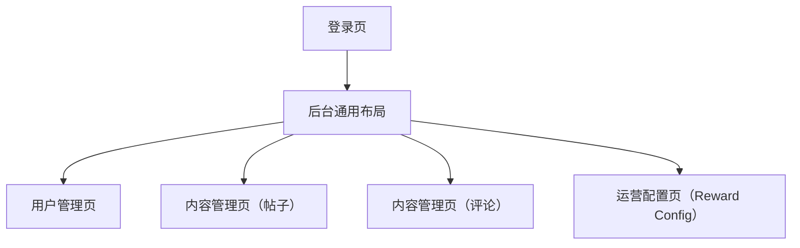

## 1. Product Overview
重设计管理端（ymd-admin）界面，使其更专业、更“留白”、更易读。
通过统一布局栅格、间距体系、字体排版与按钮层级，提升运营与治理效率。

## 2. Core Features

### 2.1 User Roles
| 角色 | 注册/登录方式 | 核心权限 |
|------|----------------|----------|
| 管理员（Superuser） | 使用现有后台登录流程 | 访问管理端各页面并执行管理操作 |

### 2.2 Feature Module
本次重设计覆盖以下核心页面：
1. **登录页**：表单排版、错误提示层级、主按钮位置与状态。
2. **后台通用布局（导航框架）**：侧边栏/顶栏、页面容器宽度、面包屑/标题区、全局间距与对齐。
3. **用户管理页**：筛选区布局、表格信息密度、行内操作按钮层级与收纳。
4. **内容管理页（帖子/评论）**：筛选与列表一致化、危险操作（删除）强调与二次确认样式。
5. **运营配置页（Reward Config）**：表单分组、说明文案、保存/取消按钮位置与反馈。

### 2.3 Page Details
| Page Name | Module Name | Feature description |
|-----------|-------------|---------------------|
| 登录页 | 版式与层级 | 统一标题/描述/输入框/帮助文案的字号与间距；将主操作按钮置于视觉流末端并支持 loading/disabled；在字段下方显示错误提示并保证可读性 |
| 后台通用布局 | 页面框架 | 设定统一内容容器宽度与最大宽度；定义页面标题区（标题/说明/主操作区）；侧边栏导航分组与当前态高亮；提供一致的空状态/加载态占位 |
| 后台通用布局 | 设计系统（最小） | 定义 8px 基础间距、字体层级（标题/正文/注释）、颜色语义（主色/危险/成功/禁用/边框）；统一按钮尺寸（主/次/幽灵/危险）与表单控件高度 |
| 用户管理页 | 筛选与列表布局 | 将筛选区域采用“首行关键筛选 + 次行高级项”的结构；表格列宽与对齐规则统一；在表格上方放置主要动作（若有）并右侧对齐 |
| 用户管理页 | 行内操作层级 | 将高频操作放为主/次按钮；低频/危险操作收纳到更多菜单；危险操作使用红色语义并提供确认对话框 |
| 内容管理页（帖子/评论） | 筛选与表格一致化 | 复用同一套筛选控件样式、按钮组与表格密度；在列表中突出关键字段（内容摘要/作者/时间）并弱化次要信息 |
| 内容管理页（帖子/评论） | 删除与确认 | 为删除提供明确层级（危险按钮）与二次确认对话框；在执行后提供成功/失败反馈区域（页面级/控件级） |
| 运营配置页（Reward Config） | 表单分组与提交区 | 将配置按业务分组（卡片/区块）；每组提供简短说明；提交区固定在表单底部并遵循“主操作在右、次操作在左”的一致规则 |

## 3. Core Process
- 管理员登录后进入后台通用布局；通过侧边栏进入用户/内容/运营配置页面。
- 你在列表页优先使用顶部筛选区定位数据；在表格行内执行操作时，系统以按钮层级与二次确认降低误操作。
- 你在配置页修改参数后，使用固定提交区保存；系统以清晰的状态反馈提示结果。

