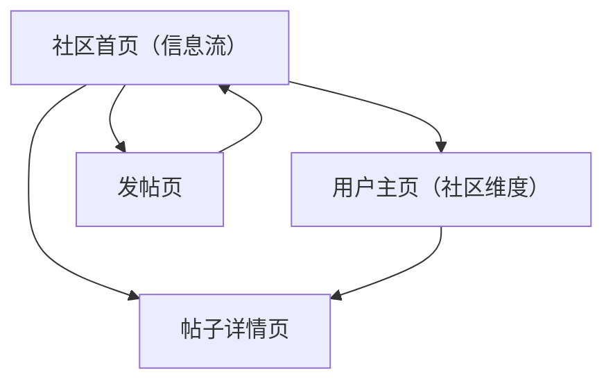

## 1. Product Overview
“社区”模块提供用户关系与内容互动能力：关注/取关、发帖/删帖、点赞/取消点赞。
目标是让用户在信息流中发现人与内容，并通过互动沉淀连接。

## 2. Core Features

### 2.1 User Roles
| 角色 | 注册/登录方式 | 核心权限 |
|------|----------------|----------|
| 访客（未登录） | 无 | 可浏览公开信息流与帖子详情 |
| 登录用户 | 手机号/微信登录（按产品现有登录方式） | 可关注/取关；可发帖；可删除自己发布的帖子；可点赞/取消点赞 |
| 管理员/运营（可选） | 后台授予 | 可删除任意帖子；可处理违规内容（仅限删帖） |

### 2.2 Feature Module
“社区”模块包含以下页面：
1. **社区首页（信息流）**：信息流浏览、点赞/取消点赞、进入用户主页、进入帖子详情。
2. **帖子详情页**：帖子内容展示、点赞/取消点赞、作者入口、删帖（仅作者/管理员）。
3. **发帖页**：图文发布、发布校验、发布结果反馈。
4. **用户主页（社区维度）**：展示用户信息与帖子列表、关注/取关。

### 2.3 Page Details
| Page Name | Module Name | Feature description |
|-----------|-------------|---------------------|
| 社区首页（信息流） | 信息流列表 | 展示帖子卡片（作者、时间、正文/图片预览、点赞数、是否已点赞）；支持下拉刷新与加载更多 |
| 社区首页（信息流） | 点赞交互 | 执行点赞/取消点赞；即时更新 UI 状态与计数；失败时回滚并提示 |
| 社区首页（信息流） | 导航入口 | 跳转帖子详情；跳转作者用户主页 |
| 帖子详情页 | 内容展示 | 展示完整帖子内容（作者、时间、正文、图片）；展示点赞状态与点赞数 |
| 帖子详情页 | 点赞交互 | 执行点赞/取消点赞；即时更新 UI 状态与计数；失败时回滚并提示 |
| 帖子详情页 | 删帖 | 作者或管理员可删除帖子；删除前二次确认；删除后返回信息流并提示 |
| 发帖页 | 图文发布 | 编辑正文与上传图片；提交发布；发布成功后返回信息流并定位到新帖（或提示刷新） |
| 发帖页 | 发布校验 | 校验正文非空（或至少包含一张图）；限制图片数量与单图大小（以产品配置为准） |
| 用户主页（社区维度） | 用户信息 | 展示头像、昵称、简介（如已有）；展示关注按钮与关注状态 |
| 用户主页（社区维度） | 关注关系 | 执行关注/取关；即时更新关注状态；失败时回滚并提示 |
| 用户主页（社区维度） | 用户帖子列表 | 展示该用户发布的帖子列表；支持进入帖子详情 |

## 3. Core Process
### 3.1 登录用户流程
1) 在“社区首页”浏览信息流，点击作者进入“用户主页”。
2) 在“用户主页”点击“关注”，建立关注关系；再次点击可“取关”。
3) 在“社区首页/帖子详情”对帖子点赞；再次点击取消点赞。
4) 在“发帖页”编辑图文并发布；发布成功后返回信息流。
5) 进入“帖子详情”对自己发布的帖子执行删除（需二次确认）。

### 3.2 访客流程
1) 可浏览“社区首页/帖子详情/用户主页”。
2) 对关注、点赞、发帖、删帖等行为点击时，引导登录后再操作。

