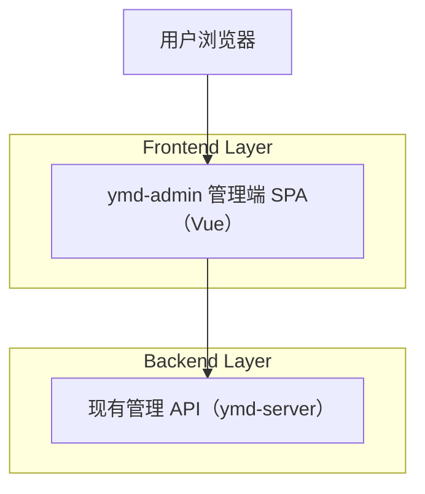

## 1.Architecture design

## 2.Technology Description
- Frontend: Vue@3 + vue-router@4 + pinia@2 + TypeScript + vite@5
- Backend: 复用现有 ymd-server（本次重设计不引入新的后端服务）
- Styling: 以全局 CSS 变量（design tokens）+ 组件 scoped CSS 为主，形成最小可复用样式体系（间距/排版/按钮/表格/表单）

## 3.Route definitions
| Route | Purpose |
|-------|---------|
| /login | 登录页，统一表单排版与主按钮层级 |
| /users | 用户管理列表页，统一筛选区与行内操作按钮层级 |
| /posts | 帖子管理列表页，统一筛选区与危险操作样式 |
| /comments | 评论管理列表页，统一筛选区与危险操作样式 |
| /reward-config | 运营配置表单页，表单分组与提交区一致化 |
