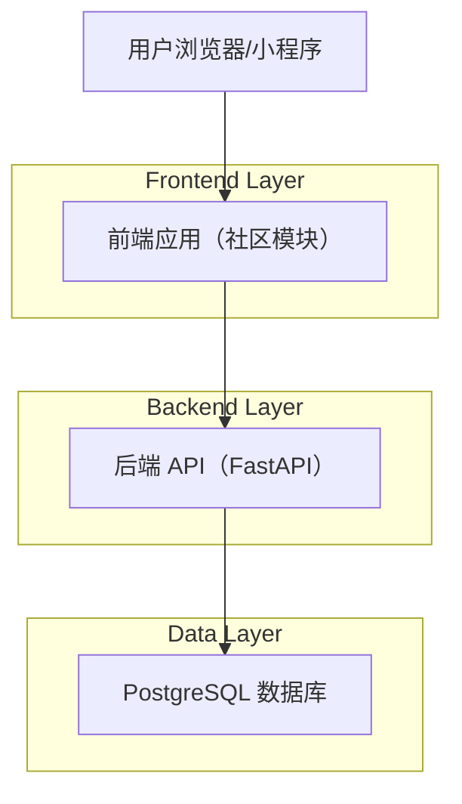
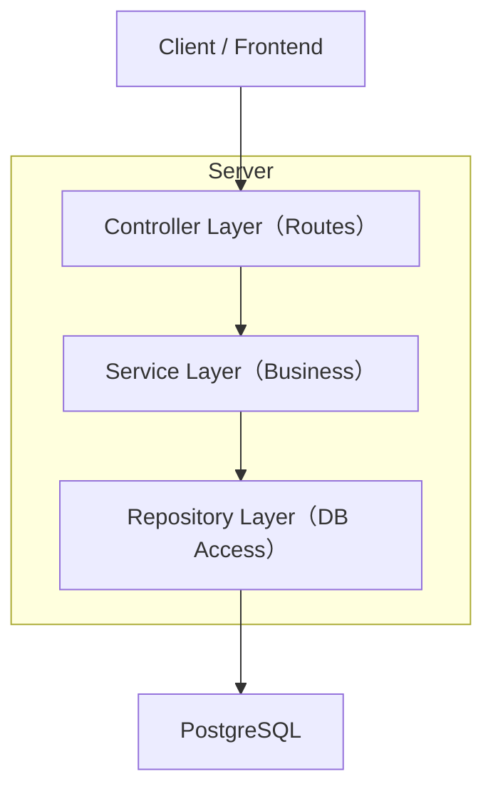
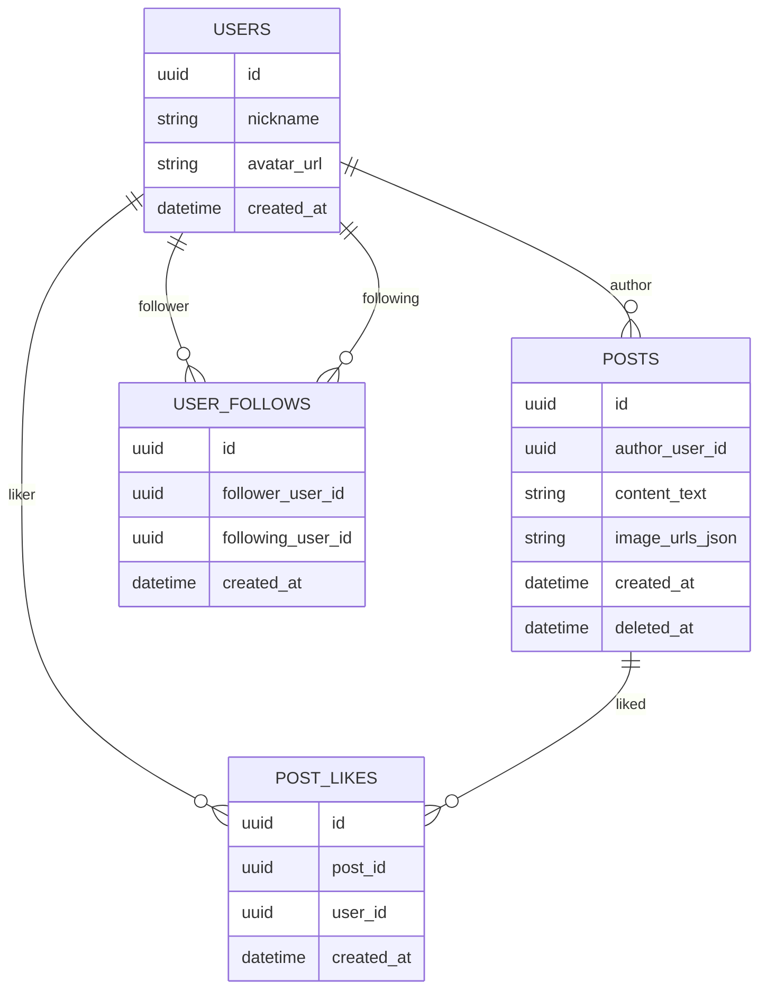

## 1.Architecture design


## 2.Technology Description
- Frontend: UniApp（Vue 3 + TypeScript）
- Backend: Python FastAPI
- Database: PostgreSQL

## 3.Route definitions
| Route | Purpose |
|-------|---------|
| /community | 社区信息流首页：浏览帖子、点赞、跳转详情/用户主页 |
| /community/post/:id | 帖子详情：查看、点赞、删帖（作者/管理员） |
| /community/new | 发帖页：图文发布 |
| /u/:id | 用户主页（社区维度）：关注/取关、查看用户帖子 |

## 4.API definitions (If it includes backend services)
### 4.1 Core API
用户关注
- `POST /api/users/{targetUserId}/follow`
- `DELETE /api/users/{targetUserId}/follow`

帖子
- `GET /api/posts?cursor=...&limit=...`（信息流）
- `GET /api/posts/{postId}`（帖子详情）
- `POST /api/posts`（发帖）
- `DELETE /api/posts/{postId}`（删帖：作者/管理员）

点赞
- `POST /api/posts/{postId}/like`
- `DELETE /api/posts/{postId}/like`

### 4.2 Shared TypeScript types (frontend-backend)
```ts
export type ID = string;

export interface UserProfileLite {
  id: ID;
  nickname: string;
  avatarUrl?: string;
}

export interface Post {
  id: ID;
  author: UserProfileLite;
  contentText: string;
  imageUrls: string[];
  likeCount: number;
  viewerHasLiked: boolean;
  createdAt: string; // ISO
  deletedAt?: string; // ISO
}

export interface FollowState {
  targetUserId: ID;
  viewerIsFollowing: boolean;
}
```

## 5.Server architecture diagram (If it includes backend services)


## 6.Data model(if applicable)

### 6.1 Data model definition


### 6.2 Data Definition Language
Users（仅示意：若项目已有 users 表，以既有为准）
```sql
-- posts
CREATE TABLE posts (
  id UUID PRIMARY KEY DEFAULT gen_random_uuid(),
  author_user_id UUID NOT NULL,
  content_text TEXT NOT NULL,
  image_urls_json JSONB NOT NULL DEFAULT '[]'::jsonb,
  created_at TIMESTAMPTZ NOT NULL DEFAULT NOW(),
  deleted_at TIMESTAMPTZ NULL
);
CREATE INDEX idx_posts_created_at ON posts (created_at DESC);
CREATE INDEX idx_posts_author ON posts (author_user_id, created_at DESC);

-- follow relation (use unique pair to prevent duplicates)
CREATE TABLE user_follows (
  id UUID PRIMARY KEY DEFAULT gen_random_uuid(),
  follower_user_id UUID NOT NULL,
  following_user_id UUID NOT NULL,
  created_at TIMESTAMPTZ NOT NULL DEFAULT NOW(),
  CONSTRAINT uq_user_follows_pair UNIQUE (follower_user_id, following_user_id)
);
CREATE INDEX idx_user_follows_follower ON user_follows (follower_user_id, created_at DESC);
CREATE INDEX idx_user_follows_following ON user_follows (following_user_id, created_at DESC);

-- post likes (unique pair to prevent duplicates)
CREATE TABLE post_likes (
  id UUID PRIMARY KEY DEFAULT gen_random_uuid(),
  post_id UUID NOT NULL,
  user_id UUID NOT NULL,
  created_at TIMESTAMPTZ NOT NULL DEFAULT NOW(),
  CONSTRAINT uq_post_likes_pair UNIQUE (post_id, user_id)
);
CREATE INDEX idx_post_likes_post ON post_likes (post_id, created_at DESC);
CREATE INDEX idx_post_likes_user ON post_likes (user_id, created_at DESC);
```

权限与校验（后端关键规则）
- 发帖：仅登录用户；服务端校验 content_text 或 image_urls 至少一项有效。
- 删帖：仅帖子作者或管理员；建议软删（填充 deleted_at），信息流与详情默认不返回已删除内容。
- 点赞/取消：仅登录用户；通过唯一约束保证幂等（重复点赞不重复计数）。
- 关注/取关：仅登录用户；禁止关注自己；通过唯一约束保证幂等。
